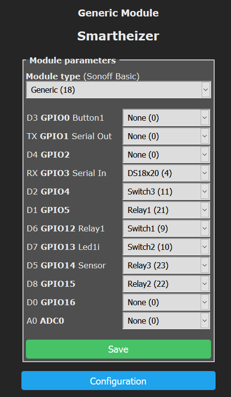
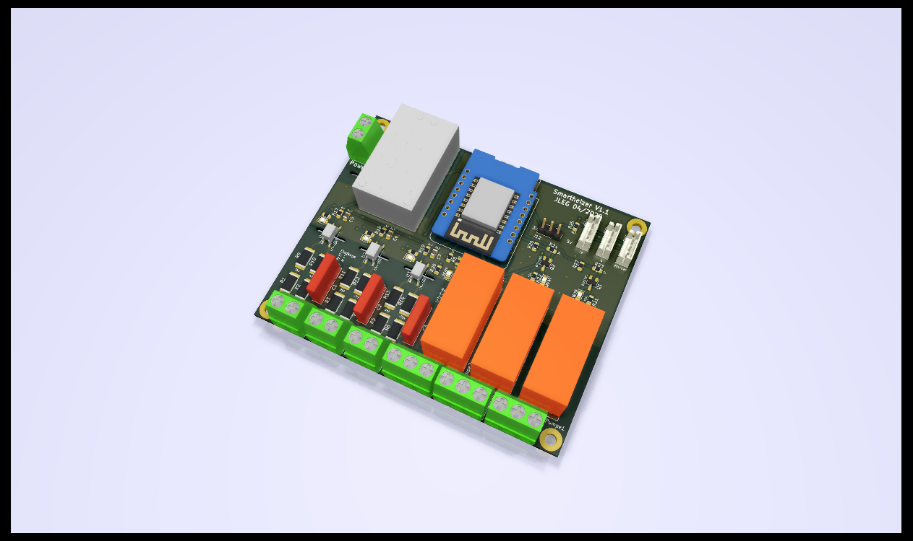
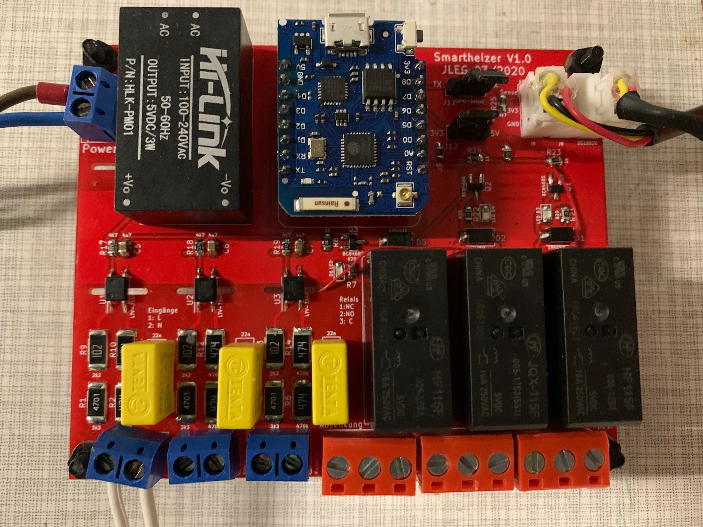
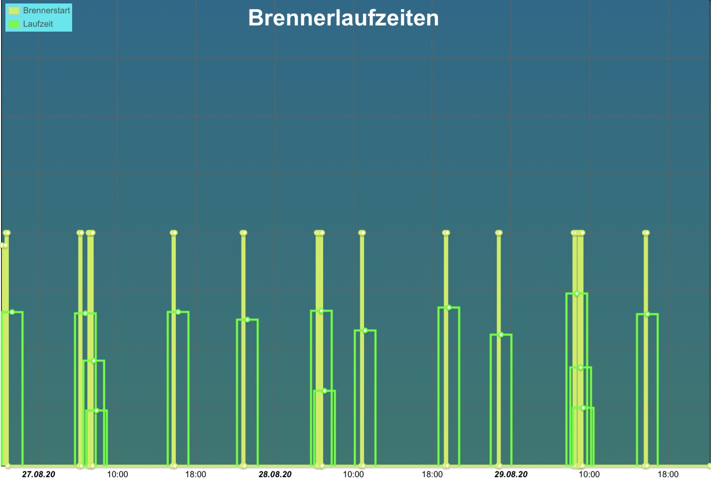

# Smartheizer
## basic heating control

 I wanted some more control for my ancient heating system:
 * enable heating remotely before returning from holidays in winter :-)
 * record activity of heating system and hot water preparation
 * embed into my <a href="https://iobroker.net"> iobroker</a> system

 ##  The hardware in short:

* provides 3 isolated inputs for recording operation times (oil burner, pumps, hot water preparation)
* 3 relays to control heating operations, night setback remotely
* 3 plugs for DS18B20 temperature sensors
* socket for Wemos D1 Mini (or Pro)
* runs with <a href="https://tasmota.github.io/docs/"> Tasmota</a>

## Software needed
* Tasmota for the Wemos D1 on the PCB, which handles the GPIO inputs, Relays and temperature sensors
* a MQTT broker running somewhere, or a smart home software like iobroker or home assistant with MQTT enabled

## Tasmota config

Wemos D1 configuration in Tasmota:

Some Tasmota configurations can be easily applied using the web console. 

1) The GPIO polarity needs to be fixed:
<pre>
Backlog Switchmode1 2; Switchmode2 2; Switchmode3 2
</pre>

2) You also need to decouple the "Switches" (which are the GPIO inputs) from the Relays (it seems like a sort of 'tradition' with tasmota, that per default "Switch1" always triggers "Relay1" etc.).
<pre>
Rule1 on Switch1#state do Publish tele/tasmota_6E171C/SENSOR {"Time":"%timestamp%", "Burner":"%value%"} endon on Switch2#state do Publish tele/tasmota_6E171C/SENSOR {"Time":"%timestamp%", "Pump1":"%value%"} endon on Switch3#state do Publish tele/tasmota_6E171C/SENSOR {"Time":"%timestamp%", "Pump2":"%value%"} endon

Rule1 1
</pre>

Of course, you may chose different topics for MQTT. 
Btw, you don't even need to use these topics with your iobroker or other software - defining the "Rule1" alone enables Tasmota to send the switch states with MQTT as well.

New PCB revision

It works! :-)

